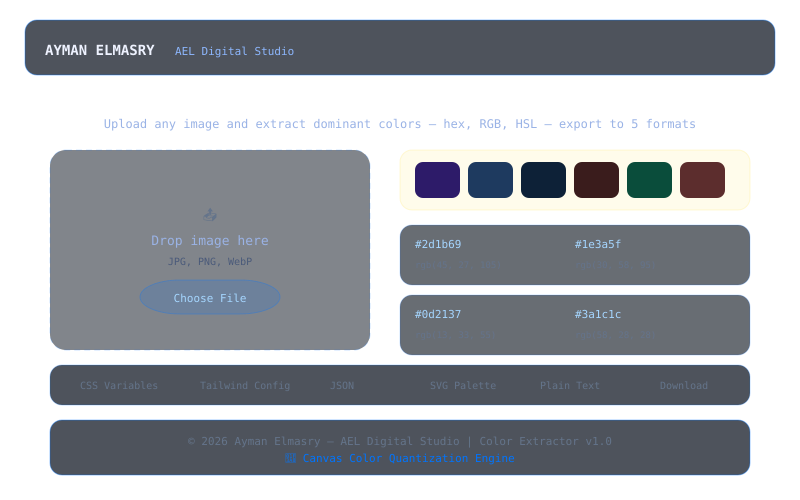

# AEL | Image Color Extractor — Smart Palette Generator

> **Upload any image and extract its dominant colors instantly.**  
> Uses canvas-based color quantization (median cut algorithm) for accurate palette generation. Get hex, RGB, and HSL values — export to 5 formats.  
> Built by Ayman Elmasry — AEL Digital Studio.

---

## Preview



---

## Table of Contents

- [Features](#features)
- [How It Works](#how-it-works)
- [Project Structure](#project-structure)
- [Getting Started](#getting-started)
- [Usage](#usage)
- [Export Formats](#export-formats)
- [Technical Details](#technical-details)
- [Credits](#credits)

---

## Features

- **Smart color extraction** — median cut quantization for accurate palettes
- **3–16 colors** — adjustable palette size for any use case
- **Quality control** — 5 levels from Fast to Most Accurate
- **5 export formats** — CSS Variables, Tailwind Config, JSON, SVG, Plain Text
- **Click to copy** — copy hex values from palette swatches
- **Drag & drop** — upload images via drag-drop or file picker
- **Canvas engine** — everything runs client-side — no server needed
- **Zero dependencies** — pure vanilla JavaScript
- **Glassmorphism UI** — dark theme with blue (#0074FF) accents

---

## How It Works

### Color Quantization Algorithm (Median Cut)

1. **Image loading** — the uploaded image is drawn to an off-screen canvas
2. **Pixel sampling** — pixels are read from the canvas using `getImageData()`
3. **Color space reduction** — RGB values are mapped into a 3D color cube
4. **Median cut** — the color cube is recursively split at the median of the longest axis
5. **Palette generation** — the average color of each cube becomes a palette entry
6. **Quality levels** — higher quality = more pixel samples = more accurate results

```
Upload → Canvas → getImageData() → Color Cube → Median Cut Recursion → Palette
```

### Color Values

Each extracted color is represented in three formats:

| Format | Example | Use Case |
|--------|---------|----------|
| Hex | `#0074FF` | Web development, CSS |
| RGB | `rgb(0, 116, 255)` | Design tools, code |
| HSL | `hsl(213, 100%, 50%)` | Color manipulation |

---

## Project Structure

```
ael-image-color-extractor/
├── index.html                    # HTML5 semantic structure
├── css/
│   └── style.css                 # All styles (glassmorphism, dark theme)
├── js/
│   └── script.js                 # Full JS engine (canvas, quantization, export)
├── screenshot.svg                # Project preview image
├── .gitignore
└── README.md
```

This separation follows modern web best practices:
- **HTML5** — semantic elements
- **CSS3** — custom properties, Flexbox/Grid, drag-drop zones
- **Vanilla JS (ES2020+)** — Canvas API, File API, median cut algorithm

---

## Getting Started

### Run Locally

```bash
git clone https://github.com/aymanelmasryael/ael-image-color-extractor.git
cd ael-image-color-extractor
open index.html
```

Or simply open `index.html` in any modern browser — no server required.

### Prerequisites

- A modern web browser (Chrome, Firefox, Safari, Edge)
- No build tools, no package managers, no server

---

## Usage

1. Upload an image (drag-drop or click to browse)
2. Adjust the number of colors (3–16) using the slider
3. Set quality level (Fast → Normal → High → Very High → Most Accurate)
4. Click **Extract Palette**
5. View hex, RGB, and HSL values for each color
6. Click any color swatch to copy its hex value
7. Export in your preferred format

### Supported Image Types

- JPEG, PNG, GIF, WebP, BMP, SVG

---

## Export Formats

| Format | Description | Example Output |
|--------|-------------|---------------|
| **CSS** | Custom properties | `--color-1: #0074FF; --color-2: ...` |
| **Tailwind** | Tailwind config | `module.exports = { theme: { extend: { colors: { ... } } } }` |
| **JSON** | Structured data | `[{ "hex": "#0074FF", "rgb": "...", "hsl": "..." }]` |
| **SVG** | Visual palette | SVG rectangles with color fills |
| **TXT** | Plain text | Space-separated hex values |

---

## Technical Details

| Aspect | Detail |
|--------|--------|
| Architecture | Static site (HTML5 + CSS3 + JS) |
| JavaScript | Vanilla ES2020+, Canvas API, File API |
| Algorithm | Median cut color quantization |
| CSS | Custom properties for theming |
| Export formats | 5 (CSS, Tailwind, JSON, SVG, TXT) |
| Browser support | Chrome, Firefox, Safari, Edge (modern versions) |
| Processing | Fully client-side — no data leaves the browser |

### Performance

- Fast quality: ~50ms for a 1920×1080 image
- Most Accurate quality: ~500ms for a 1920×1080 image
- All processing happens in-memory on an off-screen canvas

---

## Credits

**Created by:** Ayman Elmasry — AEL Digital Studio  
**Website:** [aymanelmasry.com](https://aymanelmasry.com)  
**Email:** [info@aymanelmasry.com](mailto:info@aymanelmasry.com)  
**License:** MIT — Free for personal and commercial use.

### Connect

[LinkedIn](https://linkedin.com/in/aymanelmasryael) · [Instagram](https://instagram.com/aymanelmasryael) · [X](https://x.com/aymanelmasryael) · [CodePen](https://codepen.io/aymanelmasryael) · [GitHub](https://github.com/aymanelmasryael) · [Behance](https://behance.net/aymanelmasryael)

---

*AEL Image Color Extractor v1.0*
